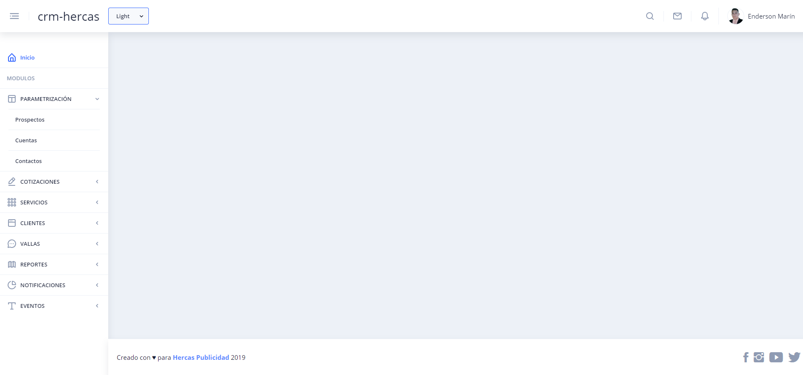
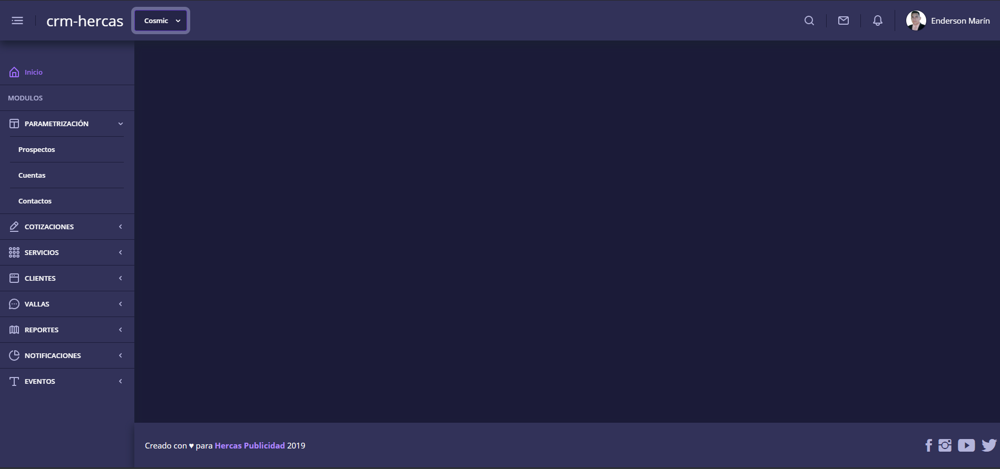
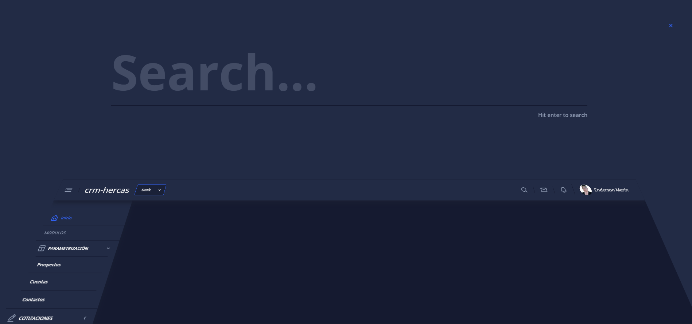

# Project Title

# Screenshots Themes





## Getting Started
```
# The easiest way to get started is to clone the repository:
git clone https://github.com/ENDERSON-MARIN/AdminProducts.git

# Change directory
cd /your_dir

# Install NPM dependencies
npm install

# Then simply start your app
npm start

you can check website will be up and running on localhost at 4200 port.
http://localhost:4200
```

### Prerequisites

you need to install following software 
1)	Nodejs https://nodejs.org/en/download/
2)  Angular CLI 

### Project Structure


## Authors

* [Enderson Marín](https://github.com/ENDERSON-MARIN)

## License

This project is licensed under the MIT License - see the [LICENSE.md](LICENSE.md) file for details

## Web Site:

* https://www.marinenderson.com/